# Ultimate black hole mass scaling relations with Symbolic Regression

## [Paper skeleton](https://www.overleaf.com/read/srkwtczhmfys)

# THE ultimate black hole mass scaling relation
```math
\LARGE
\log (\frac{\text{M}_\text{BH}}{\text{M}_\odot})=\alpha \log \sigma_0 + \beta \log (B/T) + \gamma \log \rho_\text{soi} + \delta$
```
### $\alpha=2.777\pm0.052$, $\beta=1.164\pm0.096$, $\gamma=-0.366\pm0.038$, $\delta=3.321\pm0.106$, with an intrinsic scatter $\epsilon=0.083\pm0.059 \ \textup{dex}$ in $\log M_{BH}/M_\odot$ direction.

### Intrinsic scatter $\epsilon=0.083$, while current m-sigma relation has  $\epsilon \sim 0.3$
### $\Delta_{rms}=0.27$, while current m-sigma relation has $\Delta_{rms} \sim 0.5$
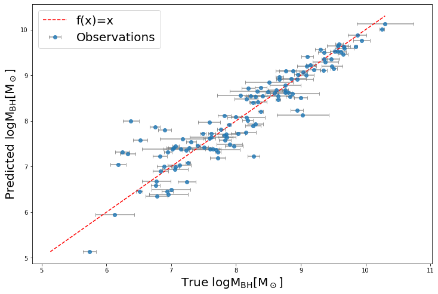

# Data
[Black hole mass catalog](SMBH_Data_0303.csv) by [Ben Davis](https://bendavis007.github.io/)

~100 direct measurement (by velocity of the orbiting stars) of black hole masses from very nearby observations, alone with other properties.

Including:

1. Black hole mass
2. Classifications: ETG/LTG, T-type, Bar, Disk, Core, Pseudobulge (0 or 1 for whether have or not have bar/disk/core/pseudobulge), …  
3. Velocity dispersion
4. Stellar mass: $M^\star_{sph}$ (bulge stellar mass) , $M^\star_{gal}$ (total stellar mass), $B/T$ (bulge mass/total mass), …
5. Radius: $R_e$, $R_{10}$, $R_{90}$, $R_{soi}$ [(sphere of influence)](https://en.wikipedia.org/wiki/Sphere_of_influence_(black_hole)), …
6. Densities: $\rho_{Re}$, $\rho_{R10}$, $\rho_{R90}$, $\rho_{Rsoi}$, …
7. Light/color: B-band luminosity, V-band luminosity, B-V, …
8. Many more, see the catalog

The columns are all considered by Symbolic Regression ([PySR](https://astroautomata.com/PySR/)) to arrive the best equation for $M_{BH}$

# Black hole mass scaling relations - Low Scatter Track
```math
\LARGE
\log (\frac{\text{M}_\text{BH}}{\text{M}_\odot})=2.8 \log \sigma_0 + 1.2 \log (B/T) - 0.3 \log \rho_\text{soi} + 3.3
```

$\Delta_{rms}=0.27$, while $M_{BH}-\sigma$ relation $\Delta_{rms} \sim 0.5$, $M_{BH}-B/T$ relation $\Delta_{rms} \sim 0.7$, $M_{BH}-\rho_{soi}$ relation $\Delta_{rms} \sim 0.65$


```math
\LARGE
\log (\frac{\text{M}_\text{BH}}{\text{M}_\odot})=2.57 \log \sigma_0 + 0.38 (\log R_e - \log \rho_\text{soi}) + bvc + 2.61
```

$\Delta_{rms}=0.25  $, while $M_{BH}-\sigma$ relation $\Delta_{rms} \sim 0.5$, $M_{BH}-R_e$ relation $\Delta_{rms} \sim 0.6$, $M_{BH}-\rho_{soi}$ relation $\Delta_{rms} \sim 0.65$

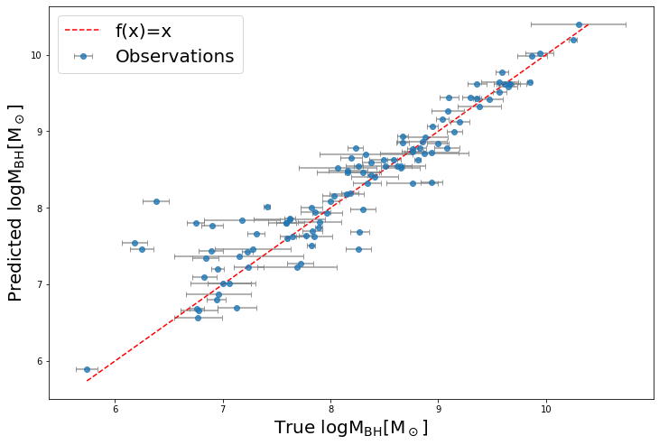

```math
\LARGE
\log (\frac{\text{M}_\text{BH}}{\text{M}_\odot})=2.57 \log \sigma_0 + \log(B/T) - 0.43 \log \rho_\text{soi} - 0.24 \ \text{Pseudobulge} + 4.01
```

$\Delta_{rms}=0.23  $, while $M_{BH}-\sigma$ relation $\Delta_{rms} \sim 0.5$, $M_{BH}-B/T$ relation $\Delta_{rms} \sim 0.7$, $M_{BH}-\rho_{soi}$ relation $\Delta_{rms} \sim 0.65$

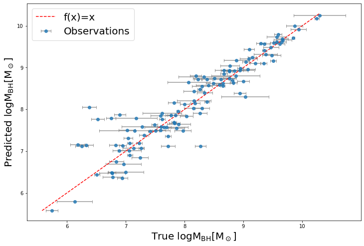


```math
\LARGE
\log (\frac{\text{M}_\text{BH}}{\text{M}_\odot})=3 \log \sigma_0 - (\log \rho_\text{soi})^{0.58} + e^{\log(B/T)-\text{Pseudobulge}} + 2.55
```

$\Delta_{rms}=0.22  $, while $M_{BH}-\sigma$ relation $\Delta_{rms} \sim 0.5$, $M_{BH}-B/T$ relation $\Delta_{rms} \sim 0.7$, $M_{BH}-\rho_{soi}$ relation $\Delta_{rms} \sim 0.65$

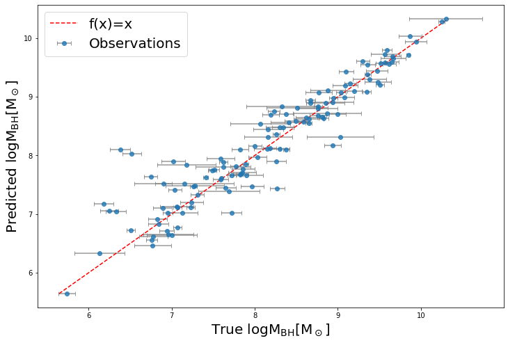


```math
\LARGE
\log (\frac{\text{M}_\text{BH}}{\text{M}_\odot})=0.91 \log \text{M}^{*}_{\text{sph}} - 0.41(\log \rho_\text{soi}+\text{Pseudobulge}) - 0.27
```

$\Delta_{rms}=0.30  $, while $M_{BH}-M^\star_{sph}$ relation $\Delta_{rms} \sim 0.5$, $M_{BH}-\rho_{soi}$ relation $\Delta_{rms} \sim 0.65$

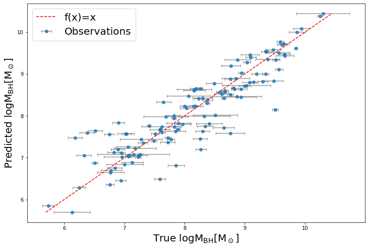


```math
\LARGE
\log (\frac{\text{M}_\text{BH}}{\text{M}_\odot})= \log \sigma_0 + 0.58 (\log \text{M}^{*}_{\text{sph}}+ \log (B/T))
```

$\Delta_{rms}=0.43  $, while $M_{BH}-\sigma$ relation $\Delta_{rms} \sim 0.5$, $M_{BH}-M^\star_{sph}$ relation $\Delta_{rms} \sim 0.5$, $M_{BH}-B/T$ relation $\Delta_{rms} \sim 0.7$

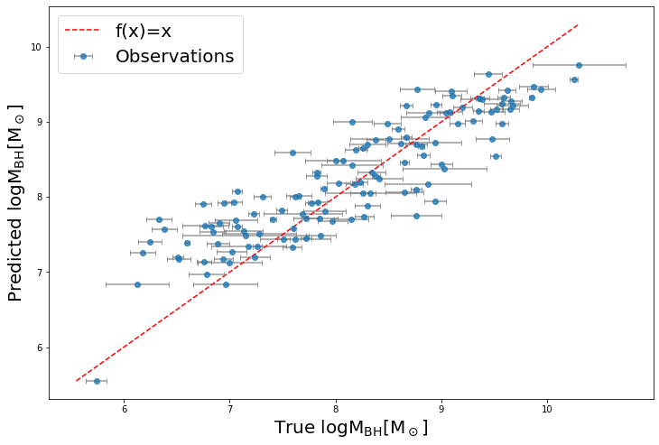


# Black hole mass scaling relations - Easy-to-use Track
## "Easy-to-use" - If you only have access to limited galaxy parameters, but you want to predict the black hole mass as accrute as possible.

### Luminosity
```math
\LARGE
\log (\frac{\text{M}_\text{BH}}{\text{M}_\odot})= \log L_{B}-\frac{1.73}{bvc}
```

$\Delta_{rms}=0.52  $, while $M_{BH}-L_B$ relation $\Delta_{rms} \sim 0.8$

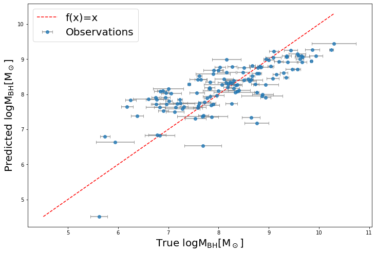


```math
\LARGE
\log (\frac{\text{M}_\text{BH}}{\text{M}_\odot})= 0.44^{bvc} + \log L_{B} - 5.52
```

$\Delta_{rms}=0.44  $, while $M_{BH}-L_B$ relation $\Delta_{rms} \sim 0.8$

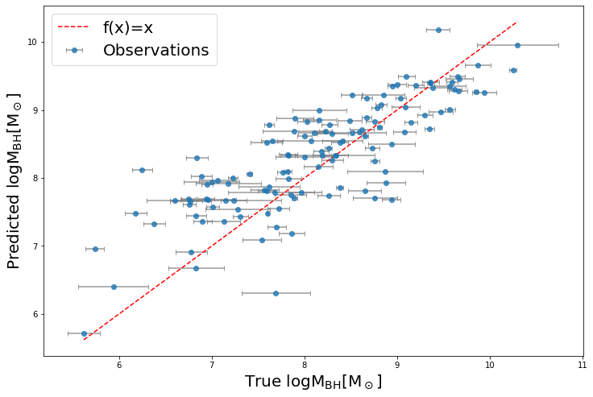


### Velocity dispersion $\sigma$
```math
\LARGE
\log (\frac{\text{M}_\text{BH}}{\text{M}_\odot})=\log \sigma_0 (3.61 + 0.23(\text{Core}-\text{Pseudobulge}))
```

$\Delta_{rms}=0.31  $, while $M_{BH}-\sigma$ relation $\Delta_{rms} \sim 0.5$

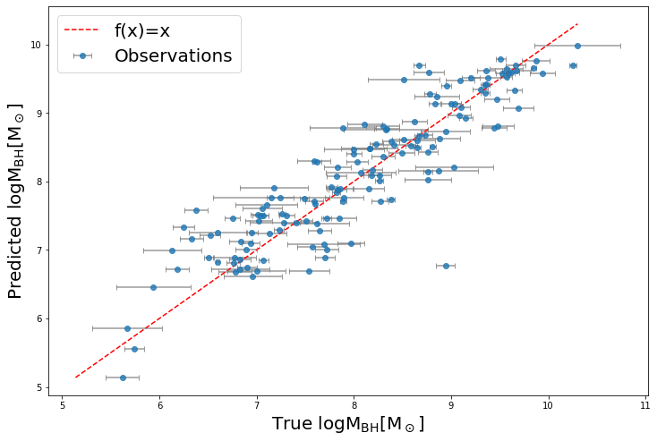


```math
\LARGE
\log (\frac{\text{M}_\text{BH}}{\text{M}_\odot})=4.14 \log \sigma_0 + 0.45 (\text{Core}-\text{Pseudobulge})-1.14
```

$\Delta_{rms}=0.312  $, while $M_{BH}-\sigma$ relation $\Delta_{rms} \sim 0.5$

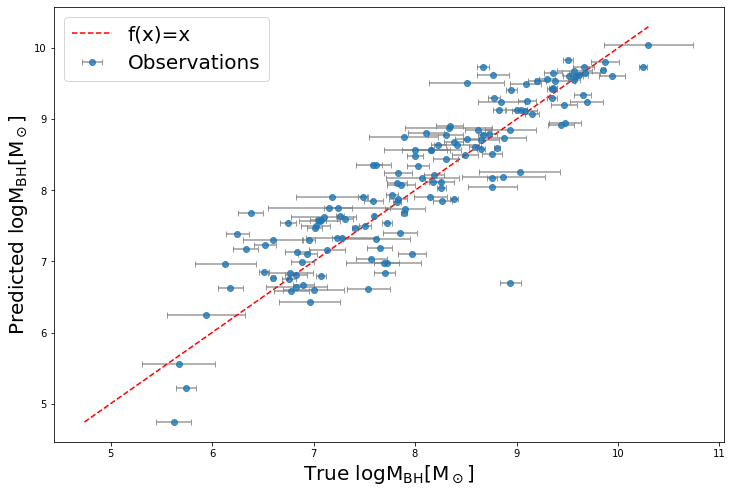


### Stellar mass of bulge $M^\star_{sph}$
```math
\LARGE
\log (\frac{\text{M}_\text{BH}}{\text{M}_\odot})= \log \text{M}^{*}_{\text{sph}} + 0.36 (\text{Core}-\text{Pseudobulge}) -2.42
```

$\Delta_{rms}=0.36  $, while $M_{BH}-M^\star_{sph}$ relation $\Delta_{rms} \sim 0.5$

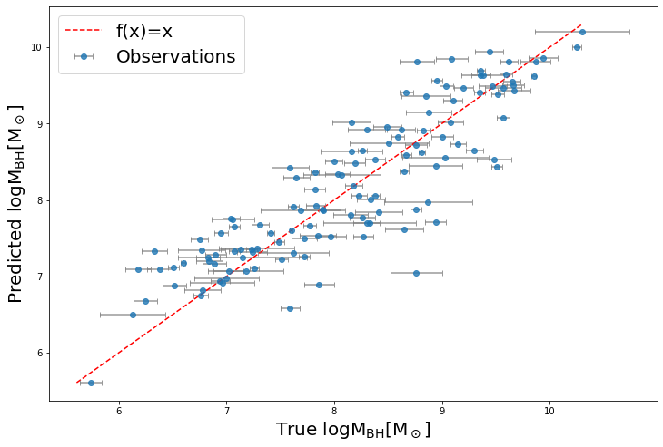

```math
\LARGE
\log (\frac{\text{M}_\text{BH}}{\text{M}_\odot})= \log \text{M}^{*}_{\text{sph}} + 0.33 (\text{Core}-\text{Pseudobulge}) + 0.17 bvc -2.54
```

$\Delta_{rms}=0.31  $, while $M_{BH}-M^\star_{sph}$ relation $\Delta_{rms} \sim 0.5$

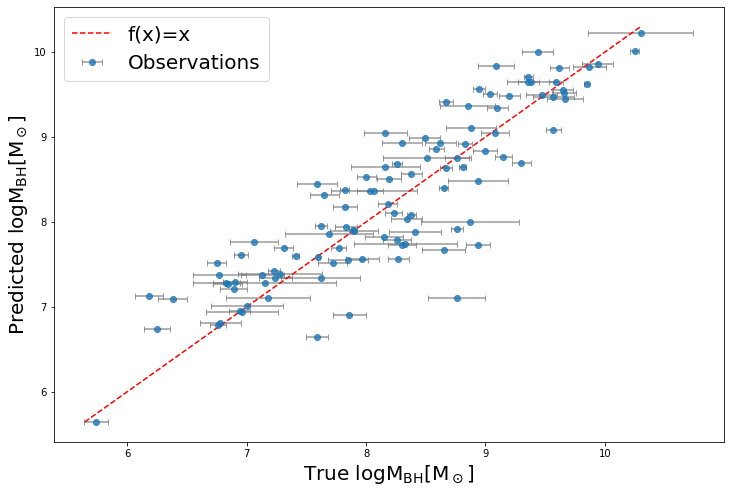


### Effective Radius of bulge $R_e$
```math
\LARGE
\log (\frac{\text{M}_\text{BH}}{\text{M}_\odot})= \log R_e + 0.67 \text{Core} + bvc + 7.06
```

$\Delta_{rms}=0.39  $, while $M_{BH}-R_e$ relation $\Delta_{rms} \sim 0.6$

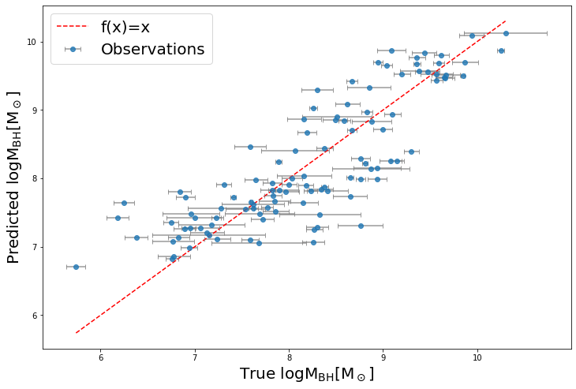
